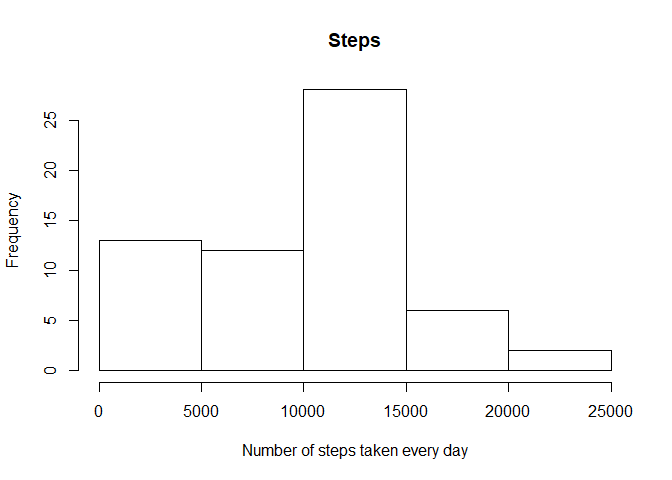
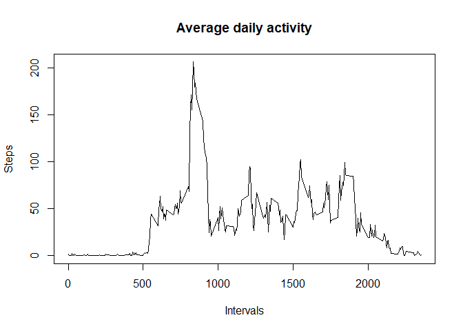
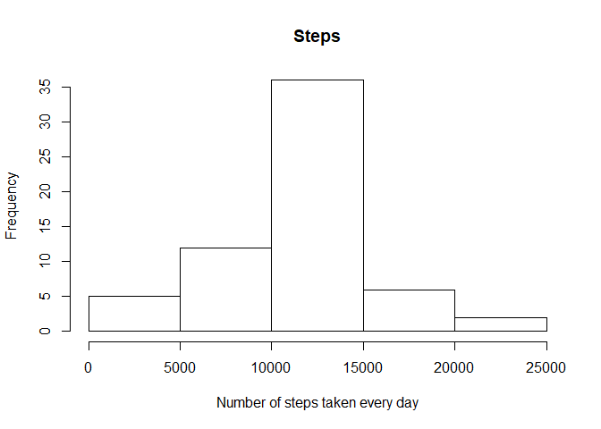

## Loading and preprocessing the data

Let's load the data and see the head of it.


```r
Activity<-read.csv('./activity/activity.csv')
Activity$date<-as.Date(Activity$date)
head(Activity)
```

```
  steps       date interval
1    NA 2012-10-01        0
2    NA 2012-10-01        5
3    NA 2012-10-01       10
4    NA 2012-10-01       15
5    NA 2012-10-01       20
6    NA 2012-10-01       25
```


## What is mean total number of steps taken per day?

First, we are going to calculate the total number of steps per day.


```r
Steps<-aggregate(Activity$steps,list(Activity$date),sum,na.rm=TRUE)
colnames(Steps)<-c('Day','Steps')
Steps
```

```
          Day Steps
1  2012-10-01     0
2  2012-10-02   126
3  2012-10-03 11352
4  2012-10-04 12116
5  2012-10-05 13294
6  2012-10-06 15420
7  2012-10-07 11015
8  2012-10-08     0
9  2012-10-09 12811
10 2012-10-10  9900
11 2012-10-11 10304
12 2012-10-12 17382
13 2012-10-13 12426
14 2012-10-14 15098
15 2012-10-15 10139
16 2012-10-16 15084
17 2012-10-17 13452
18 2012-10-18 10056
19 2012-10-19 11829
20 2012-10-20 10395
21 2012-10-21  8821
22 2012-10-22 13460
23 2012-10-23  8918
24 2012-10-24  8355
25 2012-10-25  2492
26 2012-10-26  6778
27 2012-10-27 10119
28 2012-10-28 11458
29 2012-10-29  5018
30 2012-10-30  9819
31 2012-10-31 15414
32 2012-11-01     0
33 2012-11-02 10600
34 2012-11-03 10571
35 2012-11-04     0
36 2012-11-05 10439
37 2012-11-06  8334
38 2012-11-07 12883
39 2012-11-08  3219
40 2012-11-09     0
41 2012-11-10     0
42 2012-11-11 12608
43 2012-11-12 10765
44 2012-11-13  7336
45 2012-11-14     0
46 2012-11-15    41
47 2012-11-16  5441
48 2012-11-17 14339
49 2012-11-18 15110
50 2012-11-19  8841
51 2012-11-20  4472
52 2012-11-21 12787
53 2012-11-22 20427
54 2012-11-23 21194
55 2012-11-24 14478
56 2012-11-25 11834
57 2012-11-26 11162
58 2012-11-27 13646
59 2012-11-28 10183
60 2012-11-29  7047
61 2012-11-30     0
```

Let's plot the histogram.


```r
hist(Steps$Steps,xlab='Number of steps taken every day',main='Steps')
```

<!-- -->

Now let's calculate the mean and the median of steps per day


```r
MeanMedian<-aggregate(x=Activity$steps,by=list(Activity$date),FUN=function(x) c(media=mean(x,na.rm = TRUE), mediana=median(x,na.rm=TRUE)))
MeanMedian
```

```
      Group.1    x.media  x.mediana
1  2012-10-01        NaN         NA
2  2012-10-02  0.4375000  0.0000000
3  2012-10-03 39.4166667  0.0000000
4  2012-10-04 42.0694444  0.0000000
5  2012-10-05 46.1597222  0.0000000
6  2012-10-06 53.5416667  0.0000000
7  2012-10-07 38.2465278  0.0000000
8  2012-10-08        NaN         NA
9  2012-10-09 44.4826389  0.0000000
10 2012-10-10 34.3750000  0.0000000
11 2012-10-11 35.7777778  0.0000000
12 2012-10-12 60.3541667  0.0000000
13 2012-10-13 43.1458333  0.0000000
14 2012-10-14 52.4236111  0.0000000
15 2012-10-15 35.2048611  0.0000000
16 2012-10-16 52.3750000  0.0000000
17 2012-10-17 46.7083333  0.0000000
18 2012-10-18 34.9166667  0.0000000
19 2012-10-19 41.0729167  0.0000000
20 2012-10-20 36.0937500  0.0000000
21 2012-10-21 30.6284722  0.0000000
22 2012-10-22 46.7361111  0.0000000
23 2012-10-23 30.9652778  0.0000000
24 2012-10-24 29.0104167  0.0000000
25 2012-10-25  8.6527778  0.0000000
26 2012-10-26 23.5347222  0.0000000
27 2012-10-27 35.1354167  0.0000000
28 2012-10-28 39.7847222  0.0000000
29 2012-10-29 17.4236111  0.0000000
30 2012-10-30 34.0937500  0.0000000
31 2012-10-31 53.5208333  0.0000000
32 2012-11-01        NaN         NA
33 2012-11-02 36.8055556  0.0000000
34 2012-11-03 36.7048611  0.0000000
35 2012-11-04        NaN         NA
36 2012-11-05 36.2465278  0.0000000
37 2012-11-06 28.9375000  0.0000000
38 2012-11-07 44.7326389  0.0000000
39 2012-11-08 11.1770833  0.0000000
40 2012-11-09        NaN         NA
41 2012-11-10        NaN         NA
42 2012-11-11 43.7777778  0.0000000
43 2012-11-12 37.3784722  0.0000000
44 2012-11-13 25.4722222  0.0000000
45 2012-11-14        NaN         NA
46 2012-11-15  0.1423611  0.0000000
47 2012-11-16 18.8923611  0.0000000
48 2012-11-17 49.7881944  0.0000000
49 2012-11-18 52.4652778  0.0000000
50 2012-11-19 30.6979167  0.0000000
51 2012-11-20 15.5277778  0.0000000
52 2012-11-21 44.3993056  0.0000000
53 2012-11-22 70.9270833  0.0000000
54 2012-11-23 73.5902778  0.0000000
55 2012-11-24 50.2708333  0.0000000
56 2012-11-25 41.0902778  0.0000000
57 2012-11-26 38.7569444  0.0000000
58 2012-11-27 47.3819444  0.0000000
59 2012-11-28 35.3576389  0.0000000
60 2012-11-29 24.4687500  0.0000000
61 2012-11-30        NaN         NA
```


## What is the average daily activity pattern?

Let's calculate the Average daily activity as a time series.


```r
Pattern<-aggregate(Activity$steps,list(Activity$interval),mean,na.rm=TRUE)
colnames(Pattern)<-c('Interval','Steps')
plot(Pattern$Interval,Pattern$Steps,type = 'l',xlab='Intervals',ylab='Steps',main='Average daily activity')
```

<!-- -->

The 5-minute interval which contains the maximum number of steps n average across all the days is:


```r
Pattern[which.max(Pattern$Steps),'Interval']
```

```
[1] 835
```


## Imputing missing values

Let's calculate the total of rows with Nas


```r
sum(rowSums(is.na(Activity))>0)
```

```
## [1] 2304
```


Let's fill the NA's of the steps with the mean of the intervals and create a new dataset


```r
NewActivity<-Activity
dates<-unique(NewActivity$date)

for(i in dates){
  if(sum(is.na(NewActivity[which(NewActivity$date==i),]$steps))==nrow(NewActivity[which(NewActivity$date==i),])){
    NewActivity[which(NewActivity$date==i),]$steps<-Pattern$Steps
  }
}
NewActivity$date<-as.Date(NewActivity$date)
```

Let's see the new total of steps per day and plot the new histogram.


```r
NewSteps<-aggregate(NewActivity$steps,list(NewActivity$date),sum,na.rm=TRUE)
colnames(NewSteps)<-c('Day','Steps')
NewSteps
```

```
##           Day    Steps
## 1  2012-10-01 10766.19
## 2  2012-10-02   126.00
## 3  2012-10-03 11352.00
## 4  2012-10-04 12116.00
## 5  2012-10-05 13294.00
## 6  2012-10-06 15420.00
## 7  2012-10-07 11015.00
## 8  2012-10-08 10766.19
## 9  2012-10-09 12811.00
## 10 2012-10-10  9900.00
## 11 2012-10-11 10304.00
## 12 2012-10-12 17382.00
## 13 2012-10-13 12426.00
## 14 2012-10-14 15098.00
## 15 2012-10-15 10139.00
## 16 2012-10-16 15084.00
## 17 2012-10-17 13452.00
## 18 2012-10-18 10056.00
## 19 2012-10-19 11829.00
## 20 2012-10-20 10395.00
## 21 2012-10-21  8821.00
## 22 2012-10-22 13460.00
## 23 2012-10-23  8918.00
## 24 2012-10-24  8355.00
## 25 2012-10-25  2492.00
## 26 2012-10-26  6778.00
## 27 2012-10-27 10119.00
## 28 2012-10-28 11458.00
## 29 2012-10-29  5018.00
## 30 2012-10-30  9819.00
## 31 2012-10-31 15414.00
## 32 2012-11-01 10766.19
## 33 2012-11-02 10600.00
## 34 2012-11-03 10571.00
## 35 2012-11-04 10766.19
## 36 2012-11-05 10439.00
## 37 2012-11-06  8334.00
## 38 2012-11-07 12883.00
## 39 2012-11-08  3219.00
## 40 2012-11-09 10766.19
## 41 2012-11-10 10766.19
## 42 2012-11-11 12608.00
## 43 2012-11-12 10765.00
## 44 2012-11-13  7336.00
## 45 2012-11-14 10766.19
## 46 2012-11-15    41.00
## 47 2012-11-16  5441.00
## 48 2012-11-17 14339.00
## 49 2012-11-18 15110.00
## 50 2012-11-19  8841.00
## 51 2012-11-20  4472.00
## 52 2012-11-21 12787.00
## 53 2012-11-22 20427.00
## 54 2012-11-23 21194.00
## 55 2012-11-24 14478.00
## 56 2012-11-25 11834.00
## 57 2012-11-26 11162.00
## 58 2012-11-27 13646.00
## 59 2012-11-28 10183.00
## 60 2012-11-29  7047.00
## 61 2012-11-30 10766.19
```


```r
hist(NewSteps$Steps,xlab='Number of steps taken every day',main='Steps')
```

<!-- -->

Now, let's calculate the mean and median of the new dataset.


```r
NewMeanMedian<-aggregate(x=NewActivity$steps,by=list(NewActivity$date),FUN=function(x) c(media=mean(x,na.rm = TRUE), mediana=median(x,na.rm=TRUE)))
NewMeanMedian
```

```
      Group.1    x.media  x.mediana
1  2012-10-01 37.3825996 34.1132075
2  2012-10-02  0.4375000  0.0000000
3  2012-10-03 39.4166667  0.0000000
4  2012-10-04 42.0694444  0.0000000
5  2012-10-05 46.1597222  0.0000000
6  2012-10-06 53.5416667  0.0000000
7  2012-10-07 38.2465278  0.0000000
8  2012-10-08 37.3825996 34.1132075
9  2012-10-09 44.4826389  0.0000000
10 2012-10-10 34.3750000  0.0000000
11 2012-10-11 35.7777778  0.0000000
12 2012-10-12 60.3541667  0.0000000
13 2012-10-13 43.1458333  0.0000000
14 2012-10-14 52.4236111  0.0000000
15 2012-10-15 35.2048611  0.0000000
16 2012-10-16 52.3750000  0.0000000
17 2012-10-17 46.7083333  0.0000000
18 2012-10-18 34.9166667  0.0000000
19 2012-10-19 41.0729167  0.0000000
20 2012-10-20 36.0937500  0.0000000
21 2012-10-21 30.6284722  0.0000000
22 2012-10-22 46.7361111  0.0000000
23 2012-10-23 30.9652778  0.0000000
24 2012-10-24 29.0104167  0.0000000
25 2012-10-25  8.6527778  0.0000000
26 2012-10-26 23.5347222  0.0000000
27 2012-10-27 35.1354167  0.0000000
28 2012-10-28 39.7847222  0.0000000
29 2012-10-29 17.4236111  0.0000000
30 2012-10-30 34.0937500  0.0000000
31 2012-10-31 53.5208333  0.0000000
32 2012-11-01 37.3825996 34.1132075
33 2012-11-02 36.8055556  0.0000000
34 2012-11-03 36.7048611  0.0000000
35 2012-11-04 37.3825996 34.1132075
36 2012-11-05 36.2465278  0.0000000
37 2012-11-06 28.9375000  0.0000000
38 2012-11-07 44.7326389  0.0000000
39 2012-11-08 11.1770833  0.0000000
40 2012-11-09 37.3825996 34.1132075
41 2012-11-10 37.3825996 34.1132075
42 2012-11-11 43.7777778  0.0000000
43 2012-11-12 37.3784722  0.0000000
44 2012-11-13 25.4722222  0.0000000
45 2012-11-14 37.3825996 34.1132075
46 2012-11-15  0.1423611  0.0000000
47 2012-11-16 18.8923611  0.0000000
48 2012-11-17 49.7881944  0.0000000
49 2012-11-18 52.4652778  0.0000000
50 2012-11-19 30.6979167  0.0000000
51 2012-11-20 15.5277778  0.0000000
52 2012-11-21 44.3993056  0.0000000
53 2012-11-22 70.9270833  0.0000000
54 2012-11-23 73.5902778  0.0000000
55 2012-11-24 50.2708333  0.0000000
56 2012-11-25 41.0902778  0.0000000
57 2012-11-26 38.7569444  0.0000000
58 2012-11-27 47.3819444  0.0000000
59 2012-11-28 35.3576389  0.0000000
60 2012-11-29 24.4687500  0.0000000
61 2012-11-30 37.3825996 34.1132075
```

We can tell that the steps between 10,000 and 15,000 had a increased

## Are there differences in activity patterns between weekdays and weekends?

Let's create a new factor variable if it is weekday or weekend


```r
days<-weekdays(NewActivity$date)
newday<-c()
for(i in 1:nrow(NewActivity)){
  if(days[i]=='Saturday'|days[i]=='Sunday'){
    newday<-c(newday,'weekend')
  }
  else{
    newday<-c(newday,'weekday')
  }
}
NewActivity<-cbind(NewActivity,newday)
NewActivity$newday<-as.factor(NewActivity$newday)
```

Finally let's plot a time series of average of steps vs interval by week day


```r
library(lattice)
mediatotal<-aggregate(NewActivity$steps,list(NewActivity$newday,NewActivity$interval),mean,na.rm=TRUE)
colnames(mediatotal)<-c('week','interval','steps')
xyplot(steps~interval|week,data = mediatotal,layout=c(2,1),type='l')
```

<!-- -->

